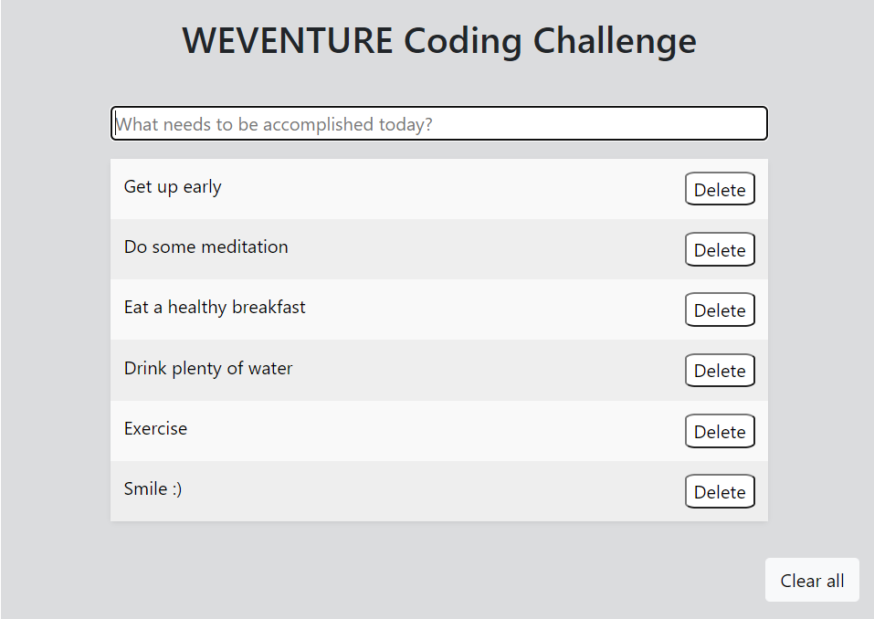

#To Do App
This is a to do application, in which you can add new tasks, delete one by one and delete the whole list.
It's made with Javascript, Css and Html with the help of Bootstrap, to run it just clone the repository and open it in the browser, you can start writing your tasks right away, I'm working on a function to mark the tasks as done.
0
